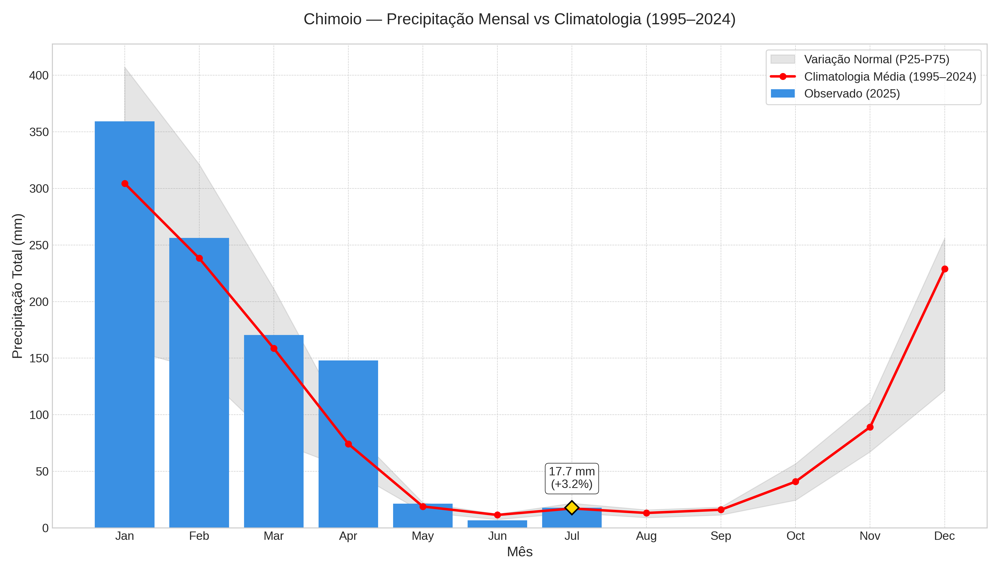
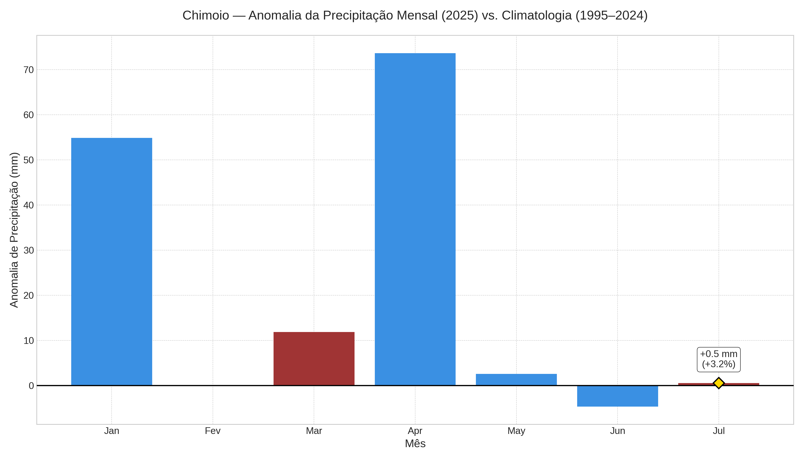
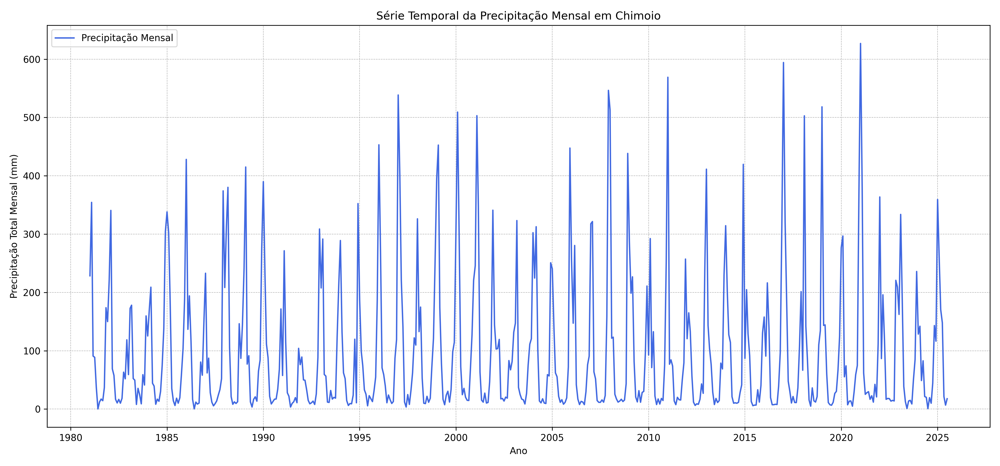
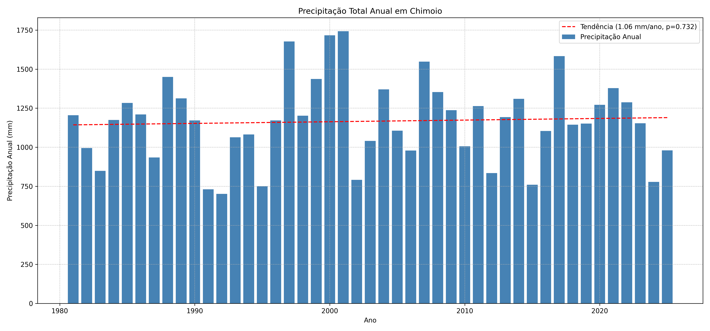
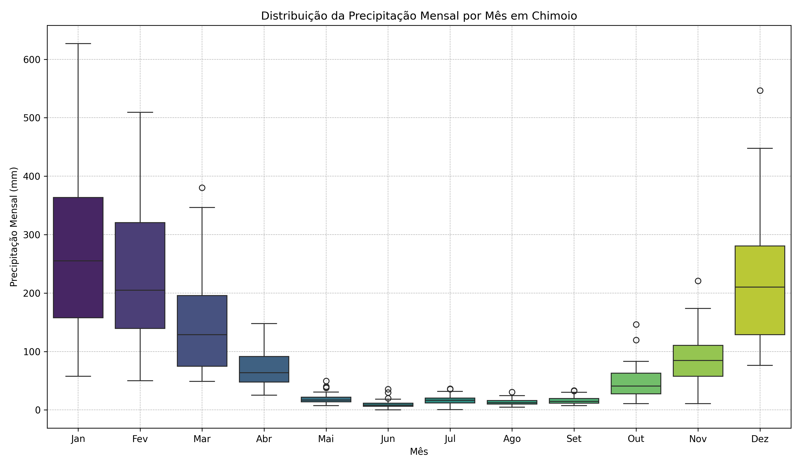
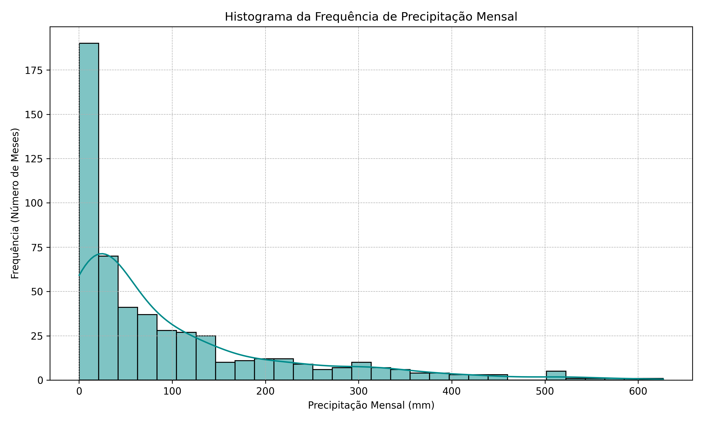

# Análise Climatológica de Precipitação para Chimoio, Moçambique

## 📖 Visão Geral

Este repositório contém os scripts e a metodologia para a análise de dados de precipitação em Chimoio, Moçambique, cobrindo o período de 1981 a 2025. O objetivo principal deste trabalho é realizar um pré-processamento robusto, um controle de qualidade e uma análise estatística e visual dos dados de chuva, comparando as observações recentes com a normal climatológica da região.

Este projeto serve como um exemplo de um fluxo de trabalho completo em agrometeorologia, desde a aquisição de dados de satélite até a geração de visualizações prontas para publicação.

## 🛰️ Aquisição e Processamento de Dados

Os dados de precipitação foram obtidos através da API do **Google Earth Engine (GEE)**, garantindo acesso a séries temporais consistentes e de alta qualidade.

1.  **Geometria da Área de Estudo:** A área de análise não se baseia num único ponto, mas sim no polígono oficial da unidade administrativa **"Cidade de Chimoio"**. Esta geometria foi extraída do dataset **FAO GAUL (Global Administrative Unit Layers)**.

2.  **Dados de Precipitação:** Utilizou-se o dataset **CHIRPS Daily**, que combina dados de satélite com observações de estações. Os dados diários foram agregados para totais mensais através de uma função de soma (`sum()`), criando uma série temporal robusta que é a base para toda a análise. O resultado é o ficheiro `precipitacao.json`.

## 🔬 Análise e Visualização

O script principal (`2_analise_precipitacao.py`) realiza um controle de qualidade, calcula estatísticas descritivas, analisa tendências e gera as seguintes visualizações de alta qualidade:

* **Precipitação vs. Climatologia:** Compara a precipitação do ano mais recente com a normal climatológica (1995-2024), incluindo a faixa de variação normal (percentis 25-75).

    

* **Gráfico de Anomalias:** Mostra o desvio (em mm) da precipitação de cada mês do ano mais recente em relação à média climatológica.

    

* **Série Temporal (1981-2025):** Mostra a evolução da precipitação mensal ao longo de todo o período.

    

* **Precipitação Anual e Tendência:** Gráfico de barras com a precipitação total de cada ano e a linha de tendência.

    

* **Sazonalidade (Boxplot):** Ilustra o padrão sazonal de chuvas ao longo do ano.

    

* **Histograma:** Mostra a distribuição de frequência dos valores de precipitação.

    

## 📁 Estrutura do Repositório

/
├── 1_download_dados_gee.py
├── 2_analise_precipitacao.py
├── precipitacao.json
├── requirements.txt
├── README.md
└── graficos/
├── 1_precip_timeseries_mensal.png
├── 1_precipitacao_vs_climatologia_variacao.png
├── 2_precip_boxplot_mensal.png
├── 2_precipitacao_anomalia_mensal.png
├── 3_precip_histograma.png
└── 4_precip_tendencia_anual.png

## 🚀 Como Usar

1.  **Pré-requisitos:** É necessário ter o Python 3 e as bibliotecas listadas no arquivo `requirements.txt`.
2.  **Autenticação:** Para o script de download de dados (`1_download_dados_gee.py`), é preciso ter uma conta no Google Earth Engine e autenticá-la.
3.  **Execução:** Execute o script `1_download_dados_gee.py` para baixar os dados. Em seguida, execute `2_analise_precipitacao.py` para realizar a análise e gerar os gráficos.

## 📊 Resultados

Todos os gráficos são salvos automaticamente na pasta `graficos`. As tabelas de resultados são salvas na pasta de saída especificada no script.

